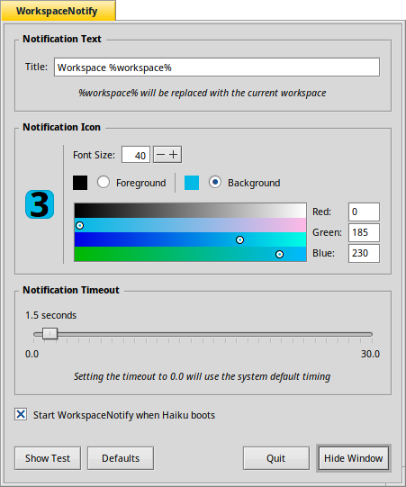

# WorkspaceNotify

A small application for [Haiku](https://www.haiku-os.org) which shows a system notification when switching workspaces.


## Usage Instructions



When the app is launched it will display the settings window.

- "Show Test" will show a notification using the current settings
- "Defaults" resets the settings to the initial values
- "Quit" closes the window and stops the app from running in the background
- "Hide Window" closes the window but keeps the app running in the background
	(***launch the app again to make the window visible***)

## Build Instructions

You must have the `jamfile_engine` package installed in order to build.

```
~> cd WorkspaceNotify
~/WorkspaceNotify> jam
~/WorkspaceNotify> jam install
```

`jam install` is required for the autostart feature.  In addition to installing the application binary it will rewrite and then copy the `WorkspaceNotify.launch` startup script to `/boot/system/non-packaged/data/user_launch`
